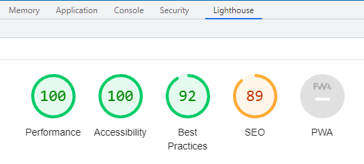

# react-calc
React Calculation Form

This is an example of a simple Calculation Form web application.

The solution uses customized React UI components and esbuild bundler.

It is available for playing by url http://github.vyatkin.com/calc

# performance

This application has much better Google Lighthouse performance score than its React versions

